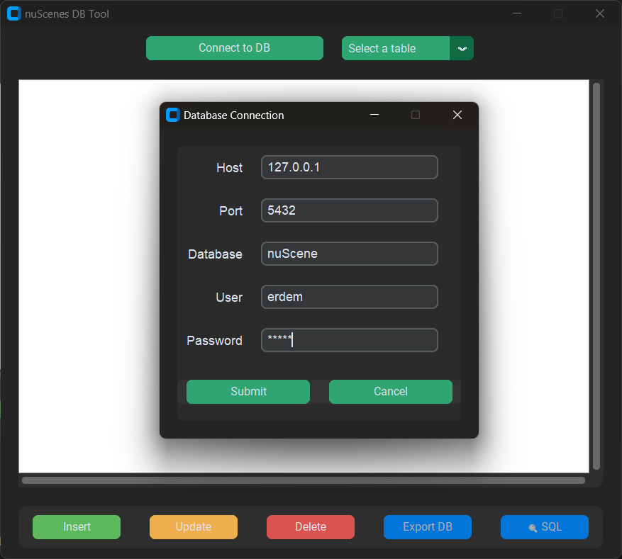
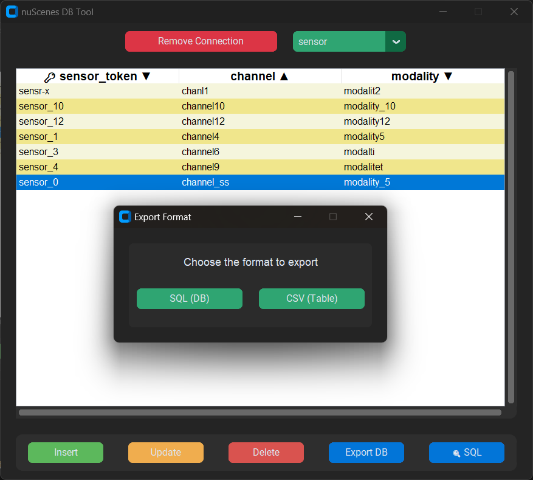

# nuScenes DB Tool - v1.0.0

**nuScenes API and DB Tool** is a Python-based application designed to manage nuScenes datasets using PostgreSQL and a FastAPI-powered REST API. This tool provides comprehensive database interaction capabilities, supports CRUD operations, custom SQL queries, and enables dataset generation from raw LiDAR samples.


## Features

- **FastAPI REST API**: Perform CRUD operations and interact with nuScenes data programmatically.
- **nuScenes Dataset Integration**:  Preprocess and load raw LiDAR data into PostgreSQL.
- **SQL Query Execution**: Run custom SQL queries directly within the app and view results.
- **Dockerized Environment**: Simplified deployment with Docker support.
- **Data Export**: Export table data or the entire database in SQL or CSV format.
- **CSV Import**: Import data into tables from CSV files.
- **GUI Enhancements**: Use a modern interface with sorting and easy navigation through tables.
- **Executable**: Available as a packaged executable under releases for easy installation.
  
## Table of Contents

- [Features](#features)
- [Installation](#installation)
- [How to Use](#how-to-use)
- [Screenshots](#screenshots)
- [Releases](#releases)
- [License](#license)

## Installation

### Option 1: Running the Executable (Recommended)

1. Download the latest release: [nuScenes DB Tool - v1.0.0](https://github.com/erdemonal11/nuScenesDB/releases/tag/exe-release).
2. Extract the files and run the `nuScenes DB Tool - v1.0.0.exe`.

### Option 2: Using Docker

1. Clone the repository:

   ```bash
   git clone https://github.com/erdemonal11/nuScenesDB.git
   cd nuscenes-db-tool
   ```
2. Create a ```.env``` file for environment variables:
   ```bash
   DB_HOST=host.docker.internal
   DB_PORT=5432
   DB_NAME=nuscenes_db
   DB_USER=postgres
   DB_PASSWORD=yourpassword
   NUSCENES_DATAROOT=/path/to/nuscenes
   SQL_FILE_PATH=/path/to/nuScene.sql
    ```
3. Build and run the Docker containers:
   ```bash
    make start-fresh
    ```
4. Access the API documentation at:  ```bash http://127.0.0.1:8000/docs ```


### Option 3: Manual Setup

1. Clone the repository:

   ```bash
   git clone https://github.com/erdemonal11/nuScenesDB.git
   cd nuscenes-db-tool
   ```

2. Install dependencies:
   ```bash
    pip install -r requirements.txt
    ```
3. Run the Python script:
   ```bash
    python nuscenetool.py
    ```

## How to Use

### Connect to Database:
1. Open the application and click **Connect to DB**.
2. Enter the PostgreSQL database credentials (Host, Port, Database, User, and Password).
3. Once connected, tables will appear in the dropdown for selection.

### CRUD Operations:
- **Insert**: Manually insert records or import from a CSV file.
- **Update**: Select a record from the table and click **Update** to modify it.
- **Delete**: Select a record and click **Delete** to remove it.

### SQL Query Execution:
- Use the **SQL** tool to write and execute custom queries.
- View the query output and export the results in CSV format.

### Export Data:
- Click **Export DB** to export either a specific table or the entire database in CSV or SQL format.

### CSV Import:
- Use the **CSV import** feature to load data into the selected table from a CSV file.

## Screenshots

### 1. Connection and UI
The interface allows you to easily connect to a PostgreSQL database by providing the necessary credentials. After connecting, available tables are listed in the dropdown.



### 2. Download Format
After selecting a table, you can export the data in SQL or CSV format.



### 3. Table Data
View, sort, and interact with the table data. You can perform CRUD operations on the records.


### 4. SQL Query Tool
Execute custom SQL queries and view the output directly in the tool.


### 5. Record Update
Use the **Update** feature to modify existing records directly from the table view.


## Releases

The latest version of the tool is available as an executable for easy installation:

- [Download nuScenes DB Tool - v1.0.0](https://github.com/erdemonal11/nuScenesDB/releases/tag/exe-release)

## License

This project is licensed under the MIT License. See the [LICENSE](./LICENSE) file for more details.

