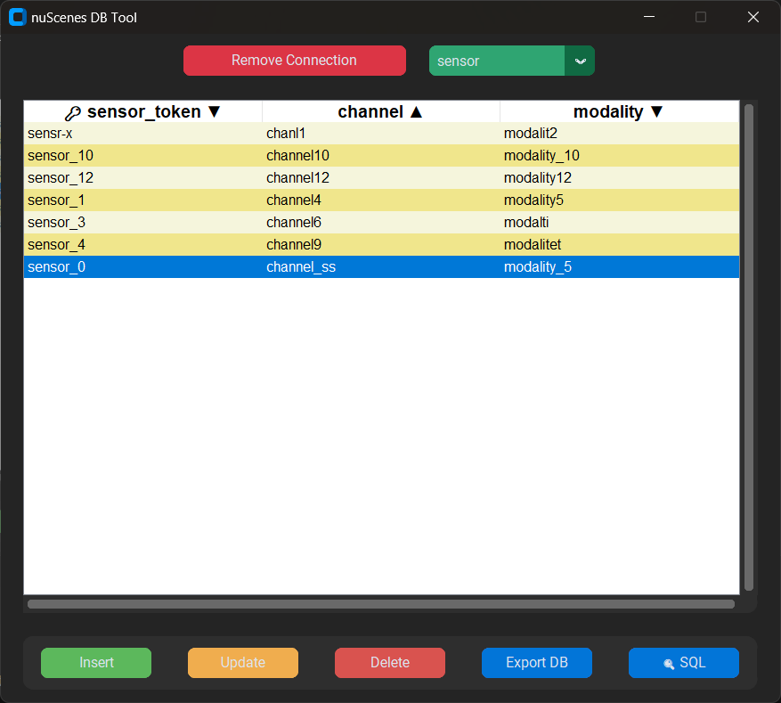
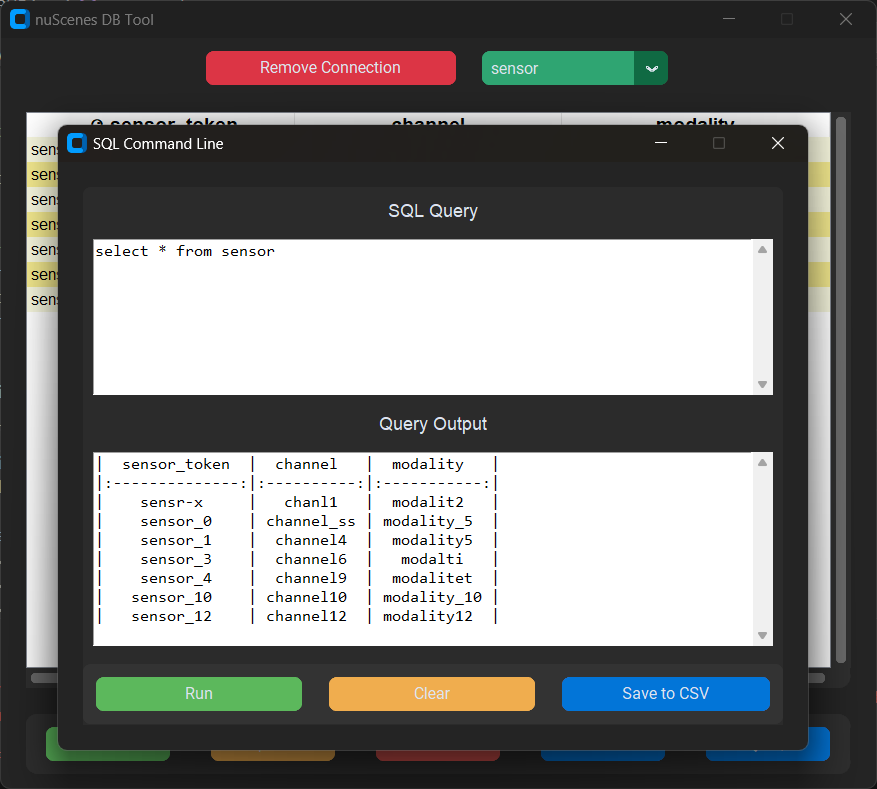

# nuScenesDB 

This project contains a Python script that connects to a PostgreSQL database and executes a SQL script. The application is containerized using Docker, allowing for easy setup and execution using `Makefile` commands.

## Project Structure

- **`nuscenetool.py`**: The main Python file containing the customtkinter GUI tool for interacting with the PostgreSQL database.
- **`dbconnect.py`**: Python script that connects to a PostgreSQL database and runs a `.sql` file.
- **`Dockerfile.nuscene`**: Dockerfile for building the container image.
- **`nuScene.sql`**: SQL script containing the schema or queries to be executed.
- **`.env`**: Environment file storing database connection parameters.
- **`Makefile`**: File containing commands to build, run, stop, clean, and rebuild the Docker container.

## Features
- Connect to PostgreSQL: Establishes a connection to a PostgreSQL database using credentials from an .env file or manual input.
- CRUD Operations: Insert, update, and delete records from the database using a user-friendly GUI.
- SQL Query Execution: Execute custom SQL queries directly from the GUI.
- Database Export: Export the entire database or selected tables in CSV or SQL format.
- Sorting and Search: Sort table columns and search through records with ease.

## Prerequisites

- Docker installed and running on your machine.
- PostgreSQL server running and configured to accept external connections.
- Python 3.10 (only if you plan to run the script outside of Docker).

## Setup

### 1. Clone the Repository

```bash
git clone <your-repository-url>
cd nuScenesDB
```

2. Create the **`.env`** File

```bash
DB_HOST=192.168.0.3
DB_PORT=5432
DB_NAME=nuScene
DB_USER=your_username
DB_PASSWORD=your_password
```

## Build and Run with Makefile

The `Makefile` provides several commands to manage the Docker container.

### 1. Build the Docker Image

```bash
make build
```

This command will start the container and execute the **`dbconnect.py`** script.

### 2. Run the Container

```bash
make run
```

### 3. Stop the Container

```bash
make stop
```

### 4. Remove the Docker Image

```bash
make clean
```

### 5. Rebuild and Run the Container

```bash
make rebuild
```

## GUI Usage
Once the container is running, you can use the GUI to interact with the database:

- Connect to Database:
Use the Connect to DB button and provide the necessary connection details or use the .env file.

- View Table Data:
Select a table from the dropdown to load its data in the table view.

- Insert, Update, and Delete Records:
Use the Insert, Update, or Delete buttons to manage records.

- Run SQL Queries:
Open the SQL query window by clicking the SQL button, enter your query, and view the results.

- Export Data:
Click Download DB to export the database in either CSV or SQL format.

## Screenshots

To better understand the functionality and user interface, here are some example screenshots of the application:

### 1. Connection and UI

The initial user interface of the **nuScenes DB Tool** allows users to click the **Connect to DB** button and enter the required database credentials (Host, Port, Database, User, and Password). Once connected, available tables populate in the dropdown list.


### 2. Download Format

After connecting to the database and selecting a table, users can choose to download the table in **SQL** or **CSV** format. The table fields such as `sensor_token`, `channel`, and `modality` are displayed in the main window.


### 3. Table Data

Once connected, the table data is displayed with columns like `sensor_token`, `channel`, and `modality`, allowing users to interact with the database records.



### 4. SQL Query Tool

The SQL Query window enables users to enter and execute custom SQL queries. Results are displayed in a console-like output with options to **Run Query**, **Clear**, or **Save to CSV**.




## Notes

- Ensure that your PostgreSQL server is configured to allow connections from the Docker container by modifying `postgresql.conf` and `pg_hba.conf`.
- The `Makefile` uses environment variables stored in the `.env` file for the database connection.
- If you encounter any issues with container name conflicts, use the `make stop` command to stop and remove existing containers before rerunning.

